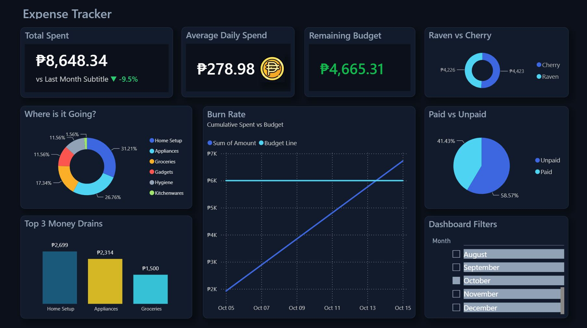
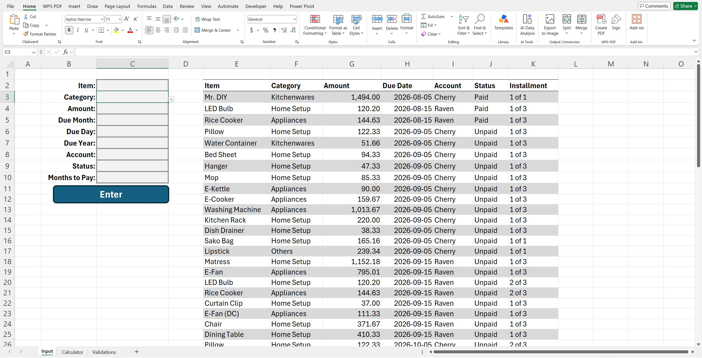
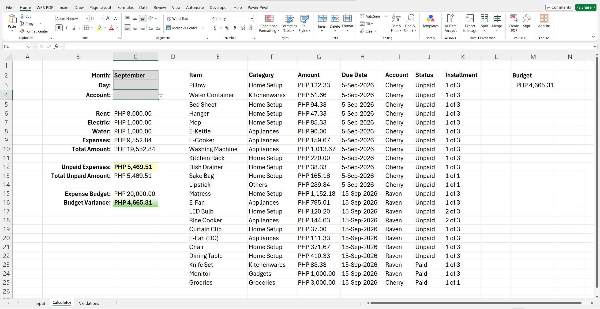
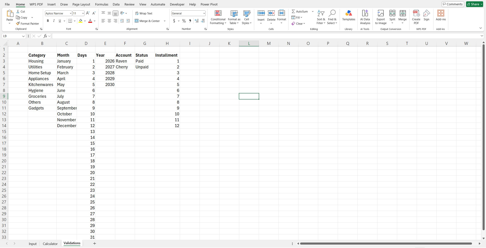

# 📊 Automated Expense Tracker & Analytics

An end-to-end financial data engineering solution that bridges data ingestion, structural ledger management, validation layers, and interactive business intelligence reporting. 

This ecosystem decouples user interface workflows, database architecture, and presentation layers using **Excel Automation (VBA)**, **Relational Ledger Modeling**, and **Power BI Visual Analytics**.

---

## 📊 Power BI Interactive Analytics Dashboard

The interactive business intelligence layer serves as the system's primary visualization hub. It converts raw historical transaction strings directly into executive visual analytics.

### 📈 Analytics & KPI Engineering Quality
*   **Executive Scorecard Matrix:** Prominently highlights **Total Spent**, **Average Daily Spend**, and **Remaining Budget** metrics. These values mirror the core Excel numbers perfectly, validating cross-platform calculations.
*   **⚠️ Scope Boundary Note (Variable Expenses Only):** The dashboard analytics engine is specifically designed to isolate and track **variable expenses** only. It systematically excludes fixed monthly overhead operational costs (such as rent, water, and electricity) to give a pristine, undistorted view of discretionary cash burn rates.
*   **Visual Budget Burn Rate:** Tracks cumulative actual spending against a flat target budget line throughout the month. This serves as an operational warning system: if the slope of the cumulative expenditure line steepens too quickly, it signals that you will exhaust your budget early.
*   **Categorical Spending Charts:** 
    *   The *"Where is it Going?"* donut chart breaks down cost concentrations by department (e.g., Home Setup at 31.21%, Appliances at 26.76%).
    *   The *"Top 3 Money Drains"* chart isolates your highest financial liabilities to identify major cost drivers instantly.
*   **Operational Filters (The Slicer Configuration):** Decouples date filters into interactive selection lists. Users can slice data and change views across different months without needing to alter the underlying data charts.

---

## 🛠 Project Architecture Overview

The system is organized into a modular pipeline, isolating user ingestion, relational validations, and downstream business intelligence processing to prevent file corruption and maintain absolute data consistency.

---

## 📂 Sheet-by-Sheet Technical Deep Dive

### 📥 1. "Input" Sheet (The Transaction Ingestion Engine)
This sheet functions as a controlled, decoupled user interface where raw data is systematically validated before writing to the database ledger. Rather than typing data directly into a table—which leads to accidental row overwrites, broken trailing formulas, and string whitespace errors—the user interacts with an asynchronous trigger form.

#### 🤖 Ingestion Engine Script: `SubmitForm()` VBA Logic
The custom VBA core features programmatic checkpoints ensuring industrial-grade data reliability:
*   **Strict Pre-Validation Matrix:** The algorithm scans all mandatory coordinates (`C2:C7`, `C10`). If a field is null, execution halts immediately with a warning alert, preventing partial or corrupted records from being ingested.
*   **String Sanitization & Type Coercion:** Input formats often vary during manual data entry. The script strips local currency flags (`PHP`), eliminates thousand-separator commas, trims trailing spaces, and safely coerces variables into double-precision floats (`CDbl`) to avoid standard runtime mismatches.
*   **Smart Date Aggregation & Catchment:** Handles text short-hands (e.g., matching "Sept", "September", or "9" smoothly using a character-clipping `Select Case` block). It passes values through an isolated `DateSerial` validator wrapped inside error-trapping syntax to smoothly manage edge-case dates like February 31.
*   **Dynamic Multi-Month Amortization Loop:** When an asset is purchased on multi-month terms, the script automatically parses the payment period. It loops through the timeline, uses the Excel `EDate` calendar function to project exact future installment due dates, maps current payment flags (e.g., `1 of 3`, `2 of 3`), and appends the records safely to the bottom of the ledger.

---

### 🧮 2. "Calculator" Sheet (The Local Operations Hub)
Serves as the ledger storage database and local analytical hub, transforming transaction strings into immediate financial metrics.

*   **The Master Ledger (`E2:K25`):** The target structured grid populated exclusively by the VBA engine. Rows append linearly without manual interference.
*   **Mathematical Variance Analysis:** Local summary cards track financial limits through explicit formulas:
    *   `Total Expenses:` Evaluates active liability costs using range sums (`=SUM(G3:G1000)`).
    *   `Budget Variance Indicator:` Measures spending limits against targets (`=C15 - C9`), identifying negative trends early.
*   **Visual Logic Anchors:** Incorporates conditional formatting structures. Cells flag unpaid liabilities in soft yellow and active savings buffers in soft green, introducing operational tracking indicators directly into the table.

---

### 🗂 3. "Validations" Sheet (The Relational Governance Layer)
This sheet serves as the backend configuration layer for the workbook. It stores structural reference arrays for Category, Month, Days, Year, Account, Status, and Installments.

*   **Architectural Separation:** Isolates data entry from administrative constants. This prevents formula breakage if categories change later.
*   **Data Consistency Rules:** Feeds drop-down constraint lists into the entry form. This prevents spelling mistakes (e.g., mistyping "Cherry" as "Chry"), ensuring clean database inputs that link seamlessly with your Power BI modeling requirements.

---

## 🛠 Tech Stack & Tools Used
*   **Microsoft Excel:** Structural ledger logging, data cleansing, form layout.
*   **Excel VBA:** Asynchronous data processing, exception handling, automated installment projections.
*   **Power BI Desktop:** Star schema data modeling, interactive dashboard engineering, time-series visualization.

---

## 💾 How To Run Locally
1. Download both the `Automated-Expense_Tracker.xlsm` file and the `Expense_Tracker.pbix` file.
2. Launch Excel and click **"Enable Macros"** when prompted to run the ingestion engine.
3. Open the `Input` sheet, fill out rows `C2:C10`, and click the **Enter** button to test the transaction routing.
4. Open the Power BI dashboard and hit **Refresh** to sync the visual metrics with your new entries!
